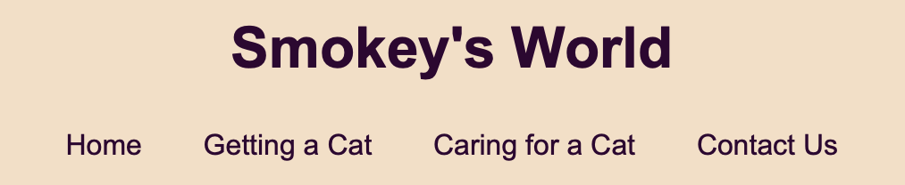
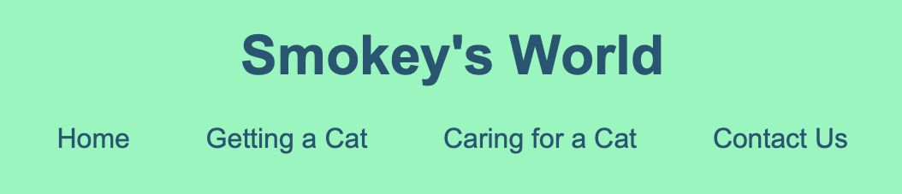
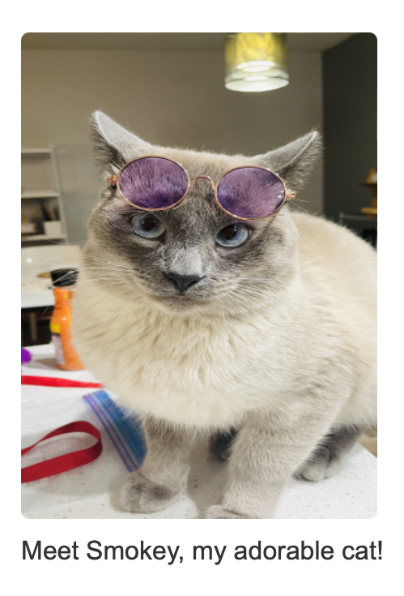
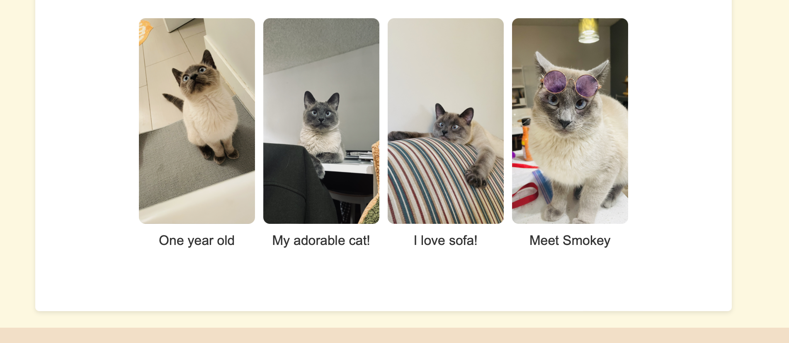
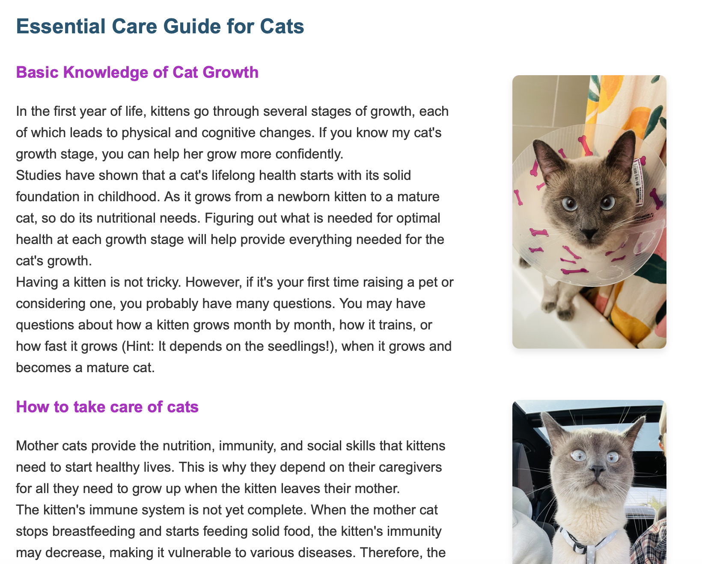

# Instructions

https://docs.google.com/document/d/1FQ8_7J8ZwtUmNAGYCSjdGhZWqdfgW86C0wREJ9Q3grE/edit?usp=sharing

# Part 1
> Complete & submit this part **at least** one week before the assignment deadline.

### Assignment Tasks & the person responsible

I'm the only team member doing the assignment and do all the work myself. 
My sketches are in the image file.

### Sketches for the website and short description

The name of this website is Smokey's World. It will show you the things you need to do before you get a cat and the items you need to keep a cat, as well as the things you need to be careful about while raising a cat.

# Part 2
> This is where you should describe how the Gestalt principles apply to your site

### Gestalt principles write-up (point form)
- Proximity: Related items like navigation links and content sections are placed close. The organization helps users quickly identify links connected to the content area, making navigation easier.

- Similarity: Consistent use of fonts and colours across different pages creates a cohesive look, enhancing brand identity and making it easier for users to recognize different sections.

- Continuity: The website layout maintains a consistent flow, allowing users to follow logical paths through the content. For example, the main content is consistent with headers and navigation, guiding users from one section to the next.

- Closure: Images used in articles, such as Smokey's photos, come with explanatory captions. This combination allows users to correlate visual and textual information to complete their understanding of the content.

- Symmetry: The page layout is designed symmetrically with a balanced text, images, and navigation layout. These symmetries create a visually easy-to-grasp structure that is easy for users to process.

- Figure-Ground Relationship: The website uses contrasting colors for the text and background, making it easy for users to identify important information (e.g., headers stand out against the body text).

- Common Fate: Elements like footers that contain contact information are consistent across all pages. This consistency indicates that these elements work together to help users understand their purpose throughout the site. 