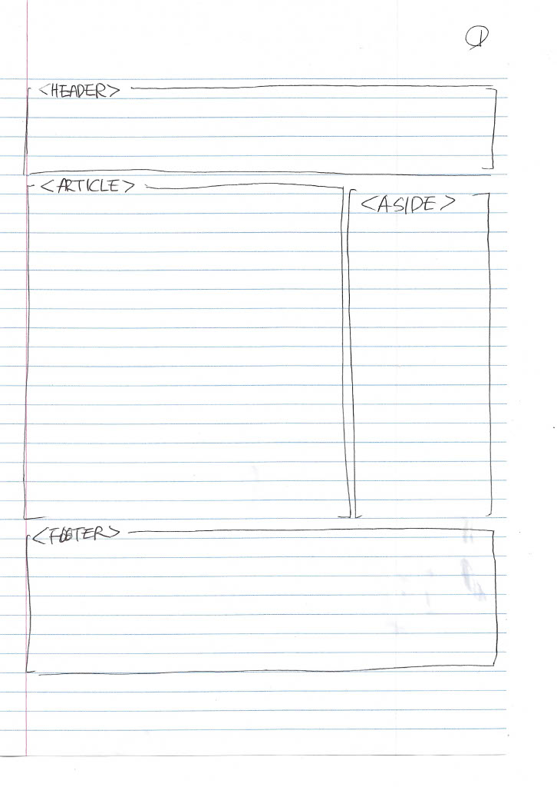
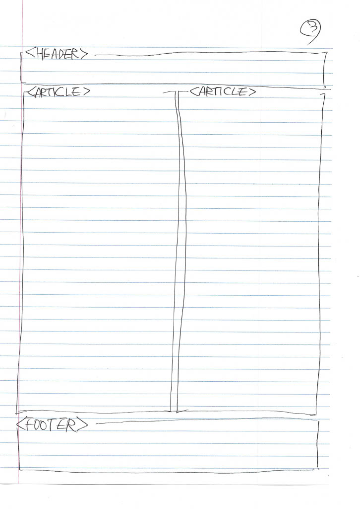
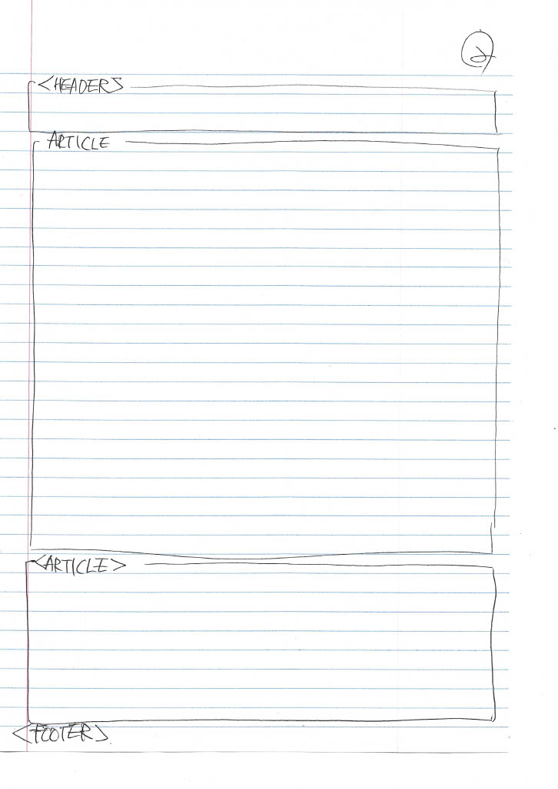

# Instructions

https://docs.google.com/document/d/1pmo_NX_ZfmEtSR7PkO8wVo0BXL2NZ5HNvDyUfYcMSJY/edit?usp=sharing 

A1 
# Part 1
> Complete & submit this part **at least** one week before the assignment deadline.

### Assignment Tasks & the person responsible

I'm the only team member doing the assignment and do all the work myself. 
My sketches are in the image file.

### Sketches for the website and short description

The name of this website is Smokey's World. It will show you the things you need to do before you get a cat and the items you need to keep a cat, as well as the things you need to be careful about while raising a cat.
Task List

Project Planning
1. Sketch Layouts
2. Content Generation
3. HTML Structure and Semantic Markup
4. Navigation Setup
5. CSS Styling
6. Responsive Design
7. Make logo
8. Image Accessibility
9. Testing and Debugging
10. Final Documentation and Report

# Part 2
> This is where you should describe how the Gestalt principles apply to your site

### Gestalt principles write-up (point form)
- Proximity: Related items like navigation links and content sections are placed close. The organization helps users quickly identify links connected to the content area, making navigation easier.

- Similarity: Consistent use of fonts and colours across different pages creates a cohesive look, enhancing brand identity and making it easier for users to recognize different sections.

- Continuity: The website layout maintains a consistent flow, allowing users to follow logical paths through the content. For example, the main content is consistent with headers and navigation, guiding users from one section to the next.

- Closure: Images used in articles, such as Smokey's photos, come with explanatory captions. This combination allows users to correlate visual and textual information to complete their understanding of the content.

- Symmetry: The page layout is designed symmetrically with a balanced text, images, and navigation layout. These symmetries create a visually easy-to-grasp structure that is easy for users to process.

- Figure-Ground Relationship: The website uses contrasting colors for the text and background, making it easy for users to identify important information (e.g., headers stand out against the body text).

- Common Fate: Elements like footers that contain contact information are consistent across all pages. This consistency indicates that these elements work together to help users understand their purpose throughout the site. 

##
# A2

1. Identify problems with manual and automatic analysis.

   During the website's development, several categories of accessibility and usability issues were found through manual and automatic analysis. 

   - Missing or inappropriate alternative text: Some images lack descriptive alternative text, or the text provided did not adequately convey the purpose of the image.

   - Labelling issues: Certain form elements are not correctly associated with labels, which can confuse users who rely on auxiliary techniques.

   - Colour contrast issues: Text and background colours did not always meet contrast ratio guidelines, making it difficult for visually impaired users to read the content

   - Keyboard navigation and focus management: Interactive elements (e.g., buttons, links) cannot be fully explored or distinguished through the keyboard, affecting users who rely on input methods rather than mice.

   - Responsive Design Challenges: Some elements' layouts and features are not optimized for smaller screen sizes or other directions, causing usability issues on mobile devices.
   
2. The type has been changed to resolve the issue.

    To address these issues, we have implemented the following common types of changes:

    - Enhanced Text Alternative: Add or improve alternative properties in the image to provide meaningful descriptions.

    - Improved label access: Ensure all form elements are correctly associated with the label tags used in the properties.

    - Increase colour contrast: Follow the WCAG instructions using an adapted colour scheme to ensure sufficient contrast between text and background.

    - Keyboard and Focus Optimization: Added focus styles to interactive elements and obtained logical tap sequences for smooth keyboard navigation.

    - Adjust responsive design: Flexible layout and media queries have been used to improve the display and usability of content across different screen sizes.

   I tried to make various corrections to solve the problem, but some parts of them did not change the error. In addition, errors were found, but some could not be corrected due to too many variations on the homepage during the correction.

3. Connection to the Gestalt Principles

    The accessibility improvement is closely consistent with the Gestalt principle of visual perception, which emphasizes order creation, clarity, and harmonization of design. 

    - Proximity and similarity: Grouping and consistently aligning relevant form elements improves the user's ability to recognize connections between inputs and labels.

    - Figure-Ground: Color contrast enhancements make it easier for users to distinguish between text (picture) and background (background), improving readability and concentration.

    - Closure and continuity: Keyboard focus and navigation changes helped reduce cognitive load by maintaining continuity while users interacted with the website.

    - Common Fate: Improved focus status and hover effects to highlight key interactive elements and effectively guide users through the interface.

    - Symmetry: Even if the screen size changes, the left and right arrangements are constant, so confusion or imbalance is not felt. The symmetrical design provides a balanced arrangement so that the user can visually search easily.

   These changes create a more intuitive, inclusive design that improves accessibility and user experience.